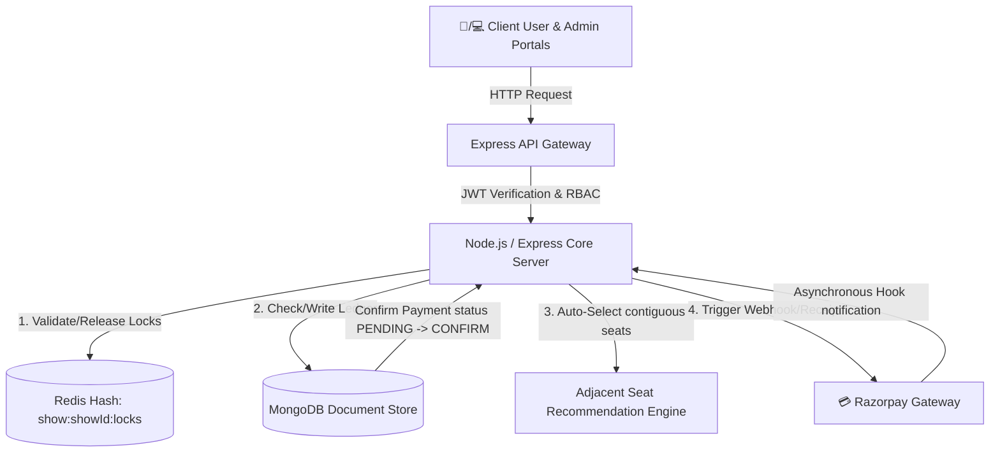

# CineFlow – Real-Time Movie Booking Platform

[](LICENSE)
[](https://nodejs.org/)
[](https://redis.io/)
[](https://www.mongodb.com/)
[](https://react.dev/)

**CineFlow** is a production-ready, high-performance **movie ticket booking platform** built using a modern full-stack architecture. The platform features role-based portal access, real-time seat reservation with concurrency control, and secure payment processing.

A core focus of CineFlow's design is **preventing race conditions and double-bookings** during high-concurrency event window rushes (e.g., blockbuster opening nights) using a robust Redis-based distributed locking system and transactional idempotency.

---

## Features

### Concurrency & Performance

- **Redis Hash-based Seating Engine:** High-performance seat reservation using a localized Redis Hash per show, avoiding database bottlenecks during seat-selection storms.
- **Lazy Seat Lock Expiration:** Lock values store expiry timestamps directly. Expirations are evaluated dynamically on-read, eliminating the CPU overhead of active key listeners.
- **Optimistic Concurrency Control:** Multi-seat lock acquisition utilizes Redis `watch` and transaction blocks (`multi`/`exec`) to guarantee thread-safe checks and writes.
- **Idempotent Payment Ledger Pattern:** Prevents duplicate ticketing and webhook-redirect race conditions using atomic MongoDB conditional updates.

### Core Business Features

- **Contiguous Adjacent Seat Recommendation:** A sliding-window recommendation engine that automatically finds and suggests the best adjacent seats closest to the center screen.
- **Secure Payments Integration:** Razorpay Sandbox workflow featuring two-phase signature verification (`HMAC-SHA256`) and automated webhook handlers.
- **Role-Based Access Control (RBAC):** JWT-secured routes with scoped permissions separating standard customers (`USER`) from system operators (`ADMIN`).
- **Show Management Scheduler:** Background cron executor powered by `ontime` that automatically cleans up past show schedules and frees storage at midnight.

---

## System Architecture



---

## Technology Stack

| Component         | Technology                    | Description                                                                                          |
| :---------------- | :---------------------------- | :--------------------------------------------------------------------------------------------------- |
| **Backend Core**  | Node.js, Express              | Event-driven, asynchronous backend environment optimized for handling concurrent bookings.           |
| **Database**      | MongoDB, Mongoose             | Flexible document store for nested seat matrix structures, movies catalogs, and ledger.              |
| **Cache & Locks** | Redis (redis npm v4)          | In-memory key-value engine supporting high-throughput lookups, multi-seat hashes, and transactions.  |
| **Frontend UI**   | React 19, Redux Toolkit, Vite | SPA portals utilizing normalized states, seat grid configurations, and responsive modern portals.    |
| **Styling**       | Tailwind CSS (v4)             | Utility-first styling for glassmorphic elements, theater layouts, and dark mode screens.             |
| **Payments**      | Razorpay Node SDK & Webhooks  | Sandbox payment order creation, SHA-256 digital signature checks, and asynchronous webhook handling. |

---

## Getting Started

### Prerequisites

Ensure you have the following installed on your local environment:

- Node.js (v18.x or later)
- MongoDB Community Server or Atlas URI
- Redis Server (defaulting to Port 6379)
- Razorpay Developer API credentials

### Setup and Installation

1. **Clone the Repository:**

   ```bash
   git clone https://github.com/venky-123-debug/cineFlow.git
   cd cineFlow
   ```

2. **Backend Configuration:**
   - Navigate to `/SERVER` directory:
     ```bash
     cd SERVER
     npm install
     ```
   - Create a `.env` file in `/SERVER` folder:
     ```env
     PORT=5000
     MONGO_URI=mongodb://localhost:27017/cineflow
     REDIS_URL=redis://localhost:6379
     JWT_SECRET=your_jwt_secret_token
     RAZORPAY_KEY_ID=your_razorpay_key_id
     RAZORPAY_KEY_SECRET=your_razorpay_key_secret
     RAZORPAY_WEBHOOK_SECRET=your_razorpay_webhook_secret
     SEAT_LOCK_DURATION=600
     ```
   - Launch backend development server:
     ```bash
     npm run dev
     ```

3. **Frontend Portals Configuration:**

   **Admin Portal (`/CLIENT/admin`):**

   ```bash
   cd ../CLIENT/admin
   npm install
   npm run dev
   ```

   **User Portal (`/CLIENT/user`):**

   ```bash
   cd ../CLIENT/user
   npm install
   npm run dev
   ```

---

## API Reference

### Authentication

- `POST /api/auth/register` - Register customer/admin account.
- `POST /api/auth/login` - Authenticate account and return a JWT access token.

### Movie & Theatre Operations

- `GET /api/movies` - Query all movies with filters.
- `GET /api/theatres` - Retrieve theatre lists.

### Booking & Show Operations

- `GET /api/shows/:id/seats` - Retrieve layout & seat statuses (overlaying active Redis locks).
- `POST /api/shows/:id/lock` - Acquire a Redis Hash seat lock for 10 minutes.
- `POST /api/bookings` - Create a `PENDING` booking ledger and return a Razorpay Order.
- `POST /api/bookings/verify-payment` - Client-side checkout confirmation and atomic booking transition.
- `POST /webhook` - Idempotent payment gateway webhook receiver.
- `GET /api/recommend/:id?count=N&category=STANDARD` - Search for adjacent contiguous seats.

---

## Engineering & Advanced Architectural Details

CineFlow is engineered to resolve 3 universal high-load movie booking challenges:

### 1. Webhook-Client Concurrency Race Condition (Idempotent Payment Ledger Pattern)

To prevent checkout failures when a client redirect fails or concurrent requests hit the gateway:

- **Pending Entry Registration:** During order creation (`POST /api/bookings/`), we immediately write a `PENDING` booking document to MongoDB.
- **Idempotent Conditional Transition:** Both the client redirect and the webhook execute an atomic update querying:
  ```javascript
  const booking = await Booking.findOneAndUpdate(
    { orderId, status: "PENDING" },
    { $set: { status: "CONFIRM", paymentId, ticketId } },
    { new: true },
  );
  ```
- **Mutex Execution:** Whichever request wins this transition gets the updated booking document and executes downstream tasks (updating MongoDB seat layouts, clearing Redis locks, sending email tickets). The loser receives `null` and yields immediately, guaranteeing zero duplicate tickets or duplicate email alerts.

### 2. Redis `KEYS` Scan CPU-Blockage (Redis Hash-based Seating Engine with Lazy Expiry)

To prevent scanning thousands of Redis keys and blocking the single-threaded Redis core:

- **Show-Level Hashing:** Instead of using separate Redis keys per seat, we store all active seat locks for a show in a single Redis Hash: `show:${showId}:locks`.
- **HGETALL Search (O(K)):** Retrieving layout statuses fetches the show locks hash in a single command, making it completely independent of other keys in the database.
- **Lazy Lock Pruning:** Seat locks store values formatted as `userId:expiresAt`. During reads or writes, expired timestamps are dynamically pruned, avoiding active cron loop calculations or key event listeners.
- **Optimistic Concurrency Control:** Locking uses Redis `watch` and transaction pipelines (`multi`/`exec`) to guarantee checking availability and setting locks are fully atomic.

### 3. High-Load Adjacent Seat Selection Bottleneck (Sliguous Sliding-Window Engine)

To save users from manual seat grid scanning under the stress of a 10-minute lock window:

- **Contiguous Adjacent Search:** A sliding window of size `N` evaluates seat layouts by row.
- **Center-Position Prioritization:** The engine scores candidates based on their distance from the theater middle:
  $$\text{Score} = (\text{CategoryMatch} \times 1000) + (\text{RowDistance} \times 15) + \text{ColDistance}$$
- Adjacent blocks closest to the center row and column get the lowest score, automatically returning the best available tickets and decreasing reservation drop-offs.

---

## License

This project is licensed under the MIT License.
