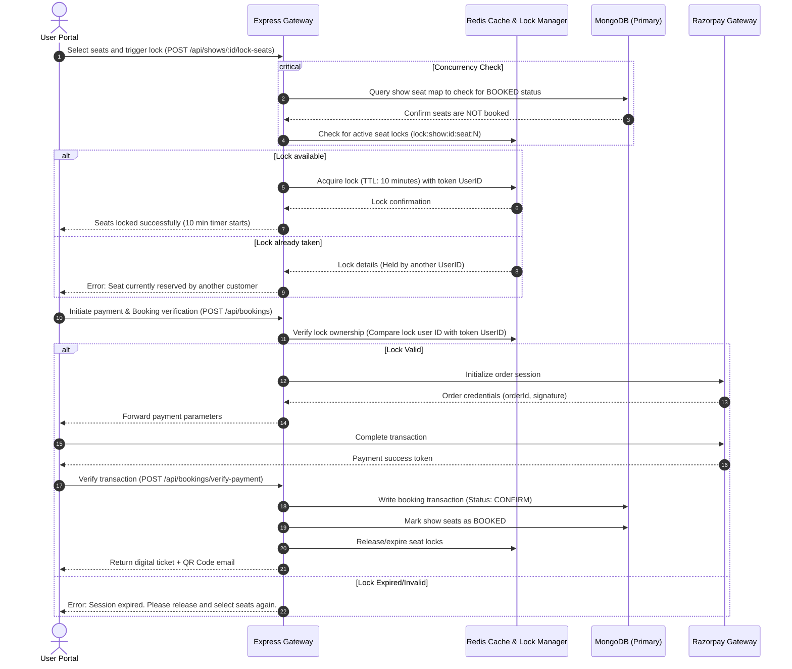

# CineFlow – Real-Time Movie Booking Platform

CineFlow is a production-ready, high-performance **movie ticket booking platform** built using a modern full-stack architecture. The platform features role-based portal access, real-time seat reservation with concurrency control, and secure payment processing. 

A core focus of CineFlow's design is **preventing race conditions and double-bookings** during high-concurrency event window rushes (e.g., blockbusters/opening night shows) using a robust Redis-based distributed locking system.

---

## 🏗️ System Architecture & Concurrency Model

CineFlow operates on an asynchronous event-driven design. The workflow below demonstrates how the User Client, Admin Client, Express Gateway, Redis Lock Manager, MongoDB Database, and Razorpay interact:



---

## ⚡ Key Technical Features

### 1. High-Concurrency Seat Locking (Redis Engine)
- Prevents double booking by implementing **optimistic distributed locking** at the seat level.
- Seats selected by a user are held in Redis with a 10-minute Time-To-Live (TTL) key (`lock:show:{showId}:seat:{seatNumber}`).
- Pre-purchase API routing checks MongoDB (`BOOKED` status) and Redis (active locks) before generating payment sessions.
- Inactive lock sessions expire automatically, freeing seats back into the public pool without database overhead.

### 2. Transaction Integrity & Webhooks (Razorpay Integration)
- Implements two-phase checkout verification: Order creation parameters validation, followed by digital signature verification (`HMAC-SHA256`) on payment completion.
- Failures or cancelled payment routes release Redis locks immediately, minimizing seat retention deadlocks.

### 3. Role-Based Access Control (RBAC) & Route Protection
- Secure authentication state powered by **JWT stateless tokens** and **SHA-256 password hashing**.
- Middleware protection blocks administrative routes (`/api/movies/add`, `/api/theatres/manage`, etc.) from client-level users.
- Custom payload parsers identify user scopes from encrypted request headers.

### 4. Automatic Show Cleanup (Cron Job Scheduler)
- Employs an integrated background scheduler powered by `ontime` to prune stale shows and free space.
- Runs every night at midnight (`00:00:00`), querying the database and deleting past shows automatically:
  ```javascript
  const result = await Show.deleteMany({ showTime: { $lt: now } })
  ```

---

## 🛠️ Technology Stack

| Layer | Technologies | Rationale |
| :--- | :--- | :--- |
| **Backend Core** | Node.js, Express | Event-driven, asynchronous environment optimized for handling multiple concurrent requests. |
| **Database** | MongoDB, Mongoose | Flexible document model for storing nested seat matrix layouts, movie catalogs, and polymorphic user/admin scopes. |
| **Cache & Lock Manager** | Redis | In-memory key-value engine supporting high-throughput lookups and atomic key creation with built-in TTL support. |
| **Frontend Core** | React 19, Redux Toolkit, React Router | Reactive component architectures, state normalization for booking status, and single-page routing structures. |
| **Styling** | Tailwind CSS (v4) | Utility-first styling for building dynamic, modern dark mode interfaces and interactive seat grids. |
| **Payment Gateway** | Razorpay SDK | Robust, localized checkout integration with automatic order creation and secure signature validation. |

---

## 🗄️ Database Schemas & Data Model

CineFlow models records across five primary MongoDB schemas:

1. **User (`users`)**: Stores credentials, roles (`USER` vs `ADMIN`), and registration metadata.
2. **Movie (`movies`)**: Houses titles, genres, descriptions, trailers, language specs, and duration properties.
3. **Theatre (`theatres`)**: Defines screens, row/column specifications, and location metadata.
4. **Show (`shows`)**: Binds a `Movie` to a `Theatre` screen, mapping unique start times, ticket pricing, and a dynamic 2D array of seat status structures (`seatNumber`, `status: [AVAILABLE | LOCKED | BOOKED]`).
5. **Booking (`bookings`)**: Holds immutable payment references (`orderId`, `paymentId`), ticket identification codes, and arrays of booked seat coordinates.

---

## 🚀 Local Development Setup

### Prerequisites
- Node.js (v18+)
- MongoDB Community Server or Atlas URI
- Redis Server (Port 6379)
- Razorpay Sandbox Account

### 1. Repository Installation
Clone the workspace:
```bash
git clone https://github.com/venky-123-debug/cineFlow.git
cd cineFlow
```

### 2. Backend Setup
1. Navigate to `/SERVER` directory:
   ```bash
   cd SERVER
   npm install
   ```
2. Create a `.env` file in the root of the `/SERVER` folder:
   ```env
   PORT=5000
   MONGO_URI=mongodb://localhost:27017/cineflow
   REDIS_URL=redis://localhost:6379
   JWT_SECRET=your_jwt_secret_token
   RAZORPAY_KEY_ID=your_razorpay_key_id
   RAZORPAY_KEY_SECRET=your_razorpay_key_secret
   SEAT_LOCK_DURATION=600
   ```
3. Launch development server:
   ```bash
   npm run dev
   ```

### 3. Frontend Portals Setup
CineFlow distributes frontend scopes into two independent client applications.

#### Admin Portal (`/CLIENT/admin`)
1. Navigate to the admin path and install packages:
   ```bash
   cd ../CLIENT/admin
   npm install
   ```
2. Start the Vite server (default port `5173`):
   ```bash
   npm run dev
   ```

#### User Portal (`/CLIENT/user`)
1. Navigate to the user path and install packages:
   ```bash
   cd ../CLIENT/user
   npm install
   ```
2. Start the Vite server (default port `5174`):
   ```bash
   npm run dev
   ```

---

## 🔮 Future Scalability Plan

To transition this platform to enterprise scale:
- **WebSocket Synchronization**: Implement Socket.io to push real-time seat locking events to active clients, avoiding HTTP polling.
- **Read-Heavy Caching**: Cache movie catalogs and show timetables in Redis with eviction policies to reduce primary database roundtrips.
- **Sharding Strategy**: Shard MongoDB collections using the `showId` partition key, preventing hot-spotting on high-demand ticket sales.
